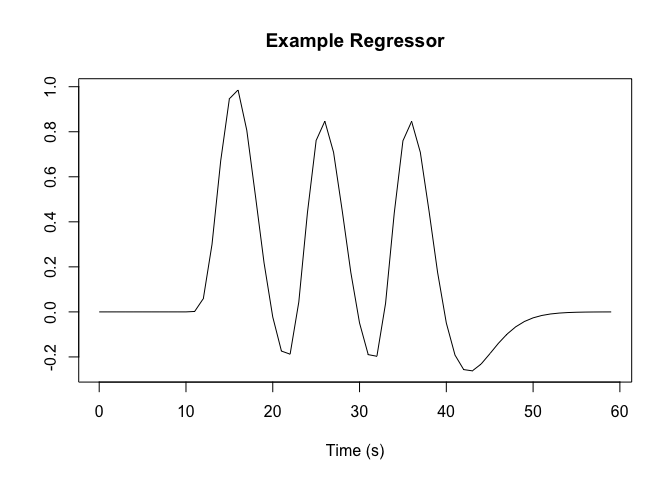
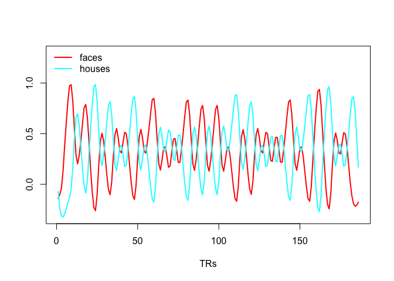
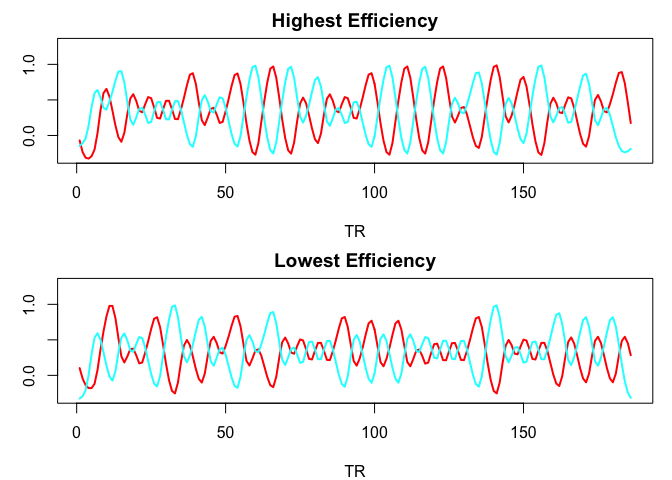

# Efficiency for fMRI
Jeanette Mumford  
8/23/2017  

This document overviews the main point of the lecture and supplies the R code for carrying out an efficiency analysis.  If you want a file with only the R code you can get that [here](https://github.com/jmumford/OnlineBrainIntensive2017/blob/master/design_efficiency_mumford.R).

## Making a single regressor
The first thing we need to know how to do is generate regressors.  This first example will walk you through that.  It requires the neuRosim library.  If you haven't already installed it, run the line that is commented out to install it first.  You only need to install a package once, but you need to load it using the "library" command in each new R session.


```r
# install.packages("neuRosim")
library(neuRosim)
```

```
## Loading required package: deSolve
```

```
## This is neuRosim 0.2-12
```

```
## neuRosim is BETA software! Please report any bugs.
```

```r
# Let's make a single regressor!
# Run length in seconds
run.length = 60
# TR in seconds
tr = 1
# Onset time in seconds
ons.times = c(10, 20 ,30)
# trial duration in seconds
dur = c(1, 1, 1)
# effect size is for simulating data.  
#  Since we only want a design matrix, 
#  we're setting it to 1 (i.e. don't scale)
eff.size = 1
 
reg = specifydesign(ons.times, dur, run.length, tr,
                    eff.size, conv = "double-gamma")
plot(seq(0, run.length-tr, tr), reg, type = 'l', xlab = "Time (s)",
     ylab = "", main = "Example Regressor")
```

<!-- -->

**On your own:** Generate your own regressors changing the TR, onset times and/or durations.  Keep the effect size at 1, though.  You won't be changing this for the creation of regressors.

## Recreating the example I showed in the slides
This example shows the efficiency calculation for the example I had in the presentation where there are two stimuli, say faces and houses, such that there are never more than 2 faces or houses in a row, the image is shown for 1s and there is a fixed iti of 2s.  The change in efficiency will be driven by the different stimulus orders.

First, let's simple create a single design matrix

```r
ntrials.each = 30 # 30 faces and 30 houses

# I will use a while loop to find an order such that 
# there is at most 2 repeats 
keep.looking = 1
while (keep.looking == 1){
  trial.type = sample(rep(c(1,2), each = ntrials.each))
  # The rle function breaks a sequence into lengths and values
  length.repeats = rle(trial.type)$lengths
  # Keep going if the max number of repeats is larger than 2
  keep.looking = max(length.repeats) > 2
}  #end while

dur = rep(1, 2*ntrials.each)
iti = rep(2, 2*ntrials.each)
# Generate onsets using a cumulative sum
# I'm adding a 0 so the first trial starts at 0s
#  Also this will be 1 too long, since the last time
#  is the iti time after the last trial, which doesn't 
#  indicate anything.  This is trimmed off.
ons.all = cumsum(c(0,dur+iti))
ons.all = ons.all[1:(2*ntrials.each)]

run.length = max(ons.all)+9 # 9s beyond last stimulus
# note about run.length.  If it isn't a multiple of TR
# the specifydesign function will fail!!
tr = 1
eff.size = 1
faces = specifydesign(ons.all[trial.type == 1], dur[trial.type == 1],
                      run.length, tr,
                      eff.size, conv = "double-gamma")
houses = specifydesign(ons.all[trial.type == 2], dur[trial.type == 2],
                      run.length, tr,
                      eff.size, conv = "double-gamma")
plot(faces, type = 'l', lwd = 2, col = 'red', xlab = "TRs", 
     ylab = '', ylim = c(min(c(faces, houses)), 1.3))
lines(houses, lwd = 2, col = 'cyan')
legend('topleft', c("faces", "houses"), col = c("red", "cyan"), lwd = c(2,2), bty = 'n')
```

<!-- -->

Now that you know how to create the regressors in the design matrix, we simply put them into a matrix, construct the contrast and compute efficiency.  I also add the intercept (column of 1s) to the design matrix.

```r
des.mat = cbind(rep(1, length(faces)), faces, houses)
con = c(0, 1, -1) # faces-houses -> faces > houses

# efficiency
# solve() is how you invert a matrix in R
# R requires %*% for matrix multiplication
1/(t(con)%*%solve(t(des.mat)%*%des.mat)%*%con)
```

```
##          [,1]
## [1,] 15.21942
```
Of course the efficiency value by itself is meaningless, but we can use it to rank a bunch of designs.  We'll use a for loop to generate 10 designs.  Basically all the code from above is copy and pasted into a loop.  

```r
n.loop = 10

# Things that don't change
ntrials.each = 30 
dur = rep(1, 2*ntrials.each)
iti = rep(2, 2*ntrials.each)
ons.all = cumsum(c(0,dur+iti))
ons.all = ons.all[1:(2*ntrials.each)]
run.length = max(ons.all)+9 
tr = 1
eff.size = 1

# Things I'd like to save
eff.val = rep(0, n.loop)
desmats = array(0,c(run.length, 3,  n.loop))

for (i in 1:n.loop){
  keep.looking = 1
  while (keep.looking == 1){
    trial.type = sample(rep(c(1,2), each = ntrials.each))
    length.repeats = rle(trial.type)$lengths 
    keep.looking = max(length.repeats) > 2
  }  #end while

  faces = specifydesign(ons.all[trial.type == 1], dur[trial.type == 1],
                      run.length, tr,
                      eff.size, conv = "double-gamma")
  houses = specifydesign(ons.all[trial.type == 2], dur[trial.type == 2],
                      run.length, tr,
                      eff.size, conv = "double-gamma")
  des.mat = cbind(rep(1, length(faces)), faces, houses)
  con = c(0, 1, -1) # faces-houses -> faces > houses

  eff.val[i] = 1/(t(con)%*%solve(t(des.mat)%*%des.mat)%*%con)
  desmats[,,i] = des.mat
}

# Plot design matrices with best and worst efficiencies
par(mfrow = c(2, 1), mar = c(4, 3, 2, 1))
# best
faces.best = desmats[,2,which(eff.val == max(eff.val))]
houses.best = desmats[,3,which(eff.val == max(eff.val))]
plot(faces.best, type = 'l', lwd = 2, col = 'red', xlab = "TR", 
     ylab = '', ylim = c(min(c(faces.best, houses.best)), 1.3),
     main = "Highest Efficiency")
lines(houses.best, lwd = 2, col = 'cyan')

faces.worst = desmats[,2,which(eff.val == min(eff.val))]
houses.worst = desmats[,3,which(eff.val == min(eff.val))]
plot(faces.worst, type = 'l', lwd = 2, col = 'red', xlab = "TR", 
     ylab = '', ylim = c(min(c(faces.worst, houses.worst)), 1.3),
     main = "Lowest Efficiency")
lines(houses.worst, lwd = 2, col = 'cyan')
```

<!-- -->

What you should notice in the final plot from the last chunk of code is the most efficient design leaned toward clumping as many trials in a row as it could (in this case 2) while the less efficient design tended to alternate houses and faces more frequently without repeats.  This is actually why you want to limit the number of consecutive trials, since, psychologically, it is not optimal to have too many in a row yet, statistically, it is best to lump them all together.  You're striking a balance.

Although the efficiency calculation is a great way to rank a bunch of designs, what if they are all bad?  The best of the worst still isn't great.  The Variance Inflation Factor helps us stay away from highly collinear designs (causes our variance to skyrocket) and helps us stay within the realm of only good designs.  In other words, choosing the best of the best!

## Variance Inflation Factor
The VIF (Variance Inflation Factor) is great because it has a (rule of thumb) threshold that we can use to assess a single design matrix.  It is only assessing collinearity issues, which are related to efficiency.  Typically the worse the collinearity the lower the efficiency.  You still need the efficiency search since it allows us to assess specific contrasts while VIF is simply checkin if a regressor is collinear with other regressors in the model.  To learn more about VIF, check out the [wiki](https://en.wikipedia.org/wiki/Variance_inflation_factor).  Here's how you compute it.

```r
# Omit the intercept
diag(solve(cor(des.mat[,2:3])))
```

```
##       C1       C1 
## 3.710111 3.710111
```
The VIFs are identical in this case because there are only 2 regressors in the model.  Both are less than 5, so this is a good design!

## Additional exercises
On you own I recommend using a design of your own to conduct an efficiency search.  Or, using the simple faces/houses design from above and try using a variable ITI.  You can use the uniform distribution with the following code:

```r
# Sample 60 ITI's randomly between 2-4s using a uniform distribution

iti.uni = runif(60, 2, 4)
```
Another option is the truncated exponential and here's how you generate samples from a truncated exponential where the exponential parameter, $\lambda$ is 1.5 and the truncation is 3s is given by the following code.  Two things to note, typically I don't use ITIs really close to 0s, so the shift variable allows me to shift it.  The values below are between 2-6s (shift to shift+T)


```r
lambda = 1.5
T = 4
nsamp = 60
shift = 2

m.theory = lambda - T/(exp(1/lambda*T)-1)

R = runif(nsamp)*(1-exp(-T/lambda))
rand.trunc.exp = -log(1-R)*lambda + shift

#theoretical mean
m.theory + shift
```

```
## [1] 3.201312
```

```r
#min ITI
min(rand.trunc.exp)
```

```
## [1] 2.00446
```

```r
#max ITI
max(rand.trunc.exp)
```

```
## [1] 5.130485
```

Of course you can also try different designs such as a stimulus followed by a response cue.  How does jittering the fixation between stimulus and cue increase the efficiency for estimating the cue vs baseline effect?

I've done a bit more with efficiency if you'd like to see those videos you can go to my youtube channel for [mumfordbrainstats](https://www.youtube.com/playlist?list=PLB2iAtgpI4YEnBdb_jDGmMcdGoIBwhCCY).
